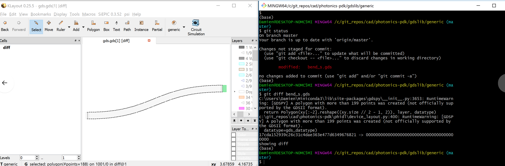
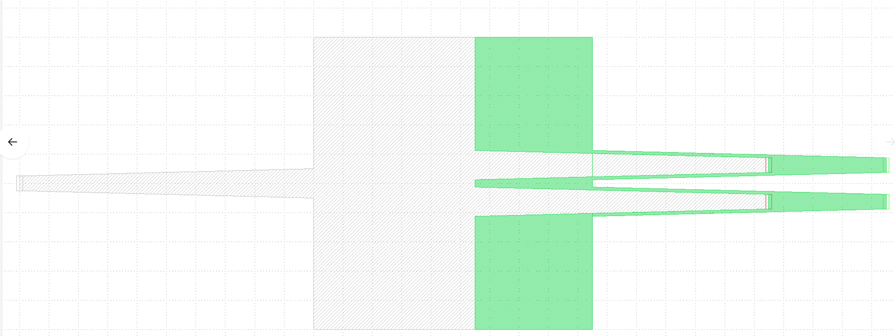

gdslib
================

the library is in a separate repo with:

- `component.nst`: netlist
- `component.dat`: FDTD sparameter data
- `component.ice`: interconnect 
- `component.md`: report
- `component.ports`: csv with port information
- `component.properties`: JSON file with component properties
- `component.gds`: GDS

We store the components GDS in a separate ``gdslib`` repo with verified components.

We hash the GDS geometry and compare it with the verified component for each component in the libary.

This check happens as part of the ``pytest`` suite before you ``png push`` code. This avoids any unwanted changes in the GDS, that sometimes are hard to see.

We only test the components in the libary that are in ``pp/components/__init__.py`` ``component_type2factory``. If you want to lock your component to the library talk to the pdk maintainers. They will:

- write your component to the library ``pp.write_to_libary("mmi1x2", width_mmi=10, overwrite=True)``
- add it in ``component_type2factory`` so it runs tests
- commit and push the gds and metadata to the gdslib repo

gdsdiff
----------

You can also `git diff` a component that has changed to ensure that the change was 
 

For example, if you changed the mmi1x2 and made it 5um longer by mistake, you could ``png diff gdslib/mmi1x2.gds`` and see results of the GDS difference in Klayout

