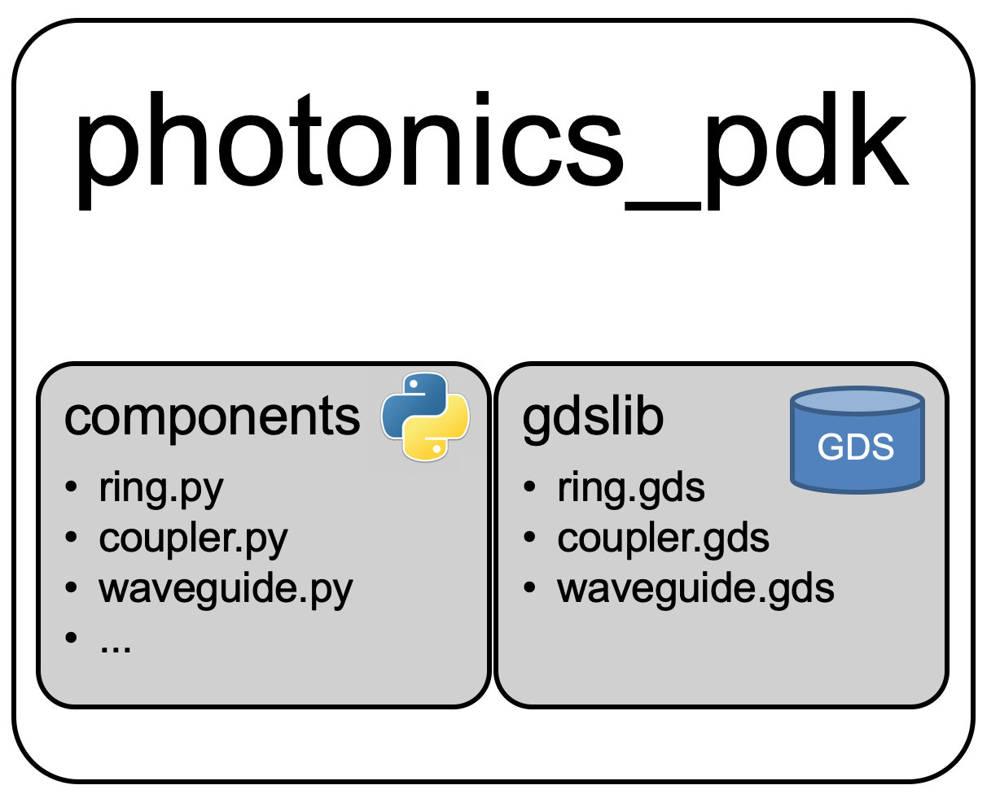

# Welcome

Gdsfactory is a Python library to layout photonic circuits:

- Define GDS components
  - Autoname cells with _meaningful_ names (optional)
  - Autoname ports (optional)
  - Define components by netlist
- Functions to route waveguides between components
- Lock components into fixed cells inside a GDS library (`gdslib`)



## Installation

If you are on Windows, you will need a C++ compiler - For Windows + Python 3, install the Microsoft ["Build Tools for Visual Studio"](https://www.visualstudio.com/downloads/#build-tools-for-visual-studio-2017)

Once you have `git` and `python3` copy-paste this 3 lines into a terminal (For windows use Git Bash)

```
git clone https://github.com/gdsfactory/gdsfactory
cd gdsfactory
bash install.sh
```

## Getting started

You can review:

- jupyter notebooks
- samples inside the photonics package (pp/samples)

## Testing

You may also invoke `pf test` at any time from the command line.

- runs functions that start with `test_function` in pp and tests folders

`the pre-commit hook` enables pre-commit hook check syntax with pyflakes

- Upon commit, `pyflakes` checks syntax/style and `black` autoformatts the code

## Gdslib

This software package comes with a default component library of locked components: gdslib.
These components are generated by the component factories listed in `component_type2factory` in `pp/components/__init__py`.

If any component of the core library changes as a result of a modification, `pf library test` raises an error.
You may check whether the change is wanted by inspecting the gds files, or using gdsdiff.

If the component modification is correct, the library has to be relocked with the new GDS file and its new hash.

This is done by manually calling the function `test_factory.py` or by manually replacing the component GDS file in `gdslib`.
Always invoke this function with care: all the components modified by this function become the new standards.
`test_factory` compares GDShash of the library with the gdslib repo, you can relock the library
