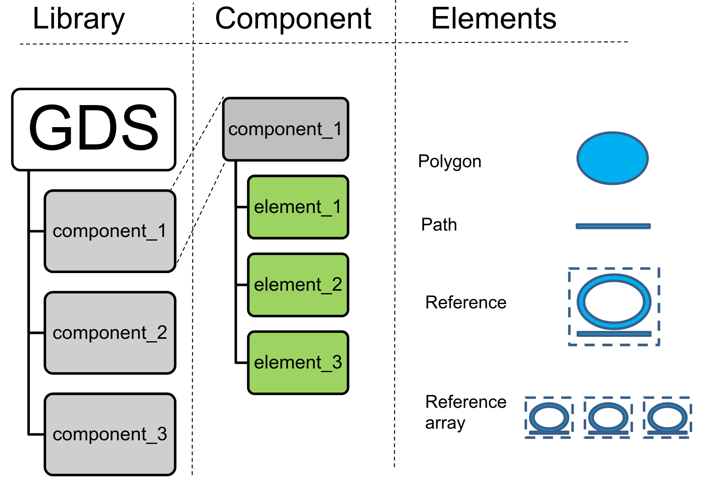
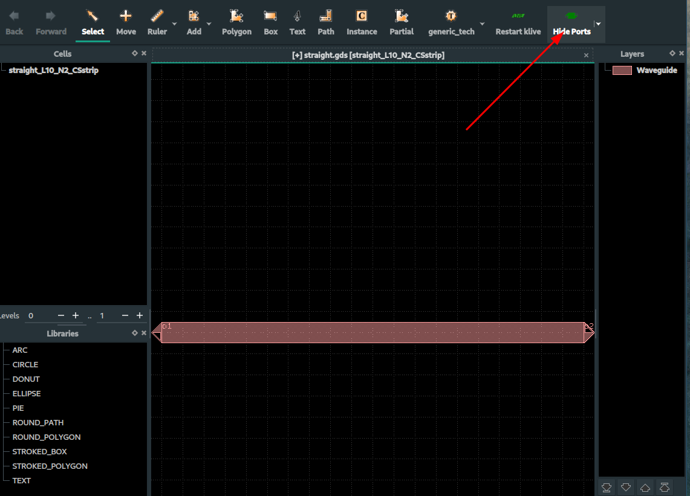

# Component basics

A `Component` is like an empty canvas, in which you can add polygons, references to other Components and ports (to connect to other components)



In gdsfactory **all dimensions** are in **microns**


## Polygons

You can add polygons to different layers. By default all units in gdsfactory are in um.

```python
import gdsfactory as gf
from gdsfactory.gpdk import PDK


gf.gpdk.PDK.activate()
# Create a blank component (essentially an empty GDS cell with some special features).
c = gf.Component()
p1 = c.add_polygon([(-8, -6), (6, 8), (7, 17), (9, 5)], layer=(1, 0))
c.write_gds("demo.gds")  # Write it to a GDS file. You can open it in klayout.
c.show()  # Show it in klayout.
c.plot()  # Plot it in jupyter notebook.

```

**Exercise:**

Make a component similar to the one above that has a second polygon in layer (2, 0)

```python
c = gf.Component()

# Create some new geometry from the functions available in the geometry library.
t = gf.components.text("Hello!")
r = gf.components.rectangle(size=(5, 10), layer=(2, 0))

# Add references to the new geometry to c, our blank component.
text1 = c.add_ref(t)  # Add the text we created as a reference.
# Using the << operator (identical to add_ref()), add the same geometry a second time.
text2 = c << t
r = c << r  # Add the rectangle we created.

# Now that the geometry has been added to "c", we can move everything around:
text1.movey(25)
text2.move((5, 30))
text2.rotate(45)
r.movex(-15)

print(c)
c.plot()
```

```python
c = gf.Component()
p1 = c.add_polygon(
    [(-8, -6), (6, 8), (7, 17), (9, 5)], layer=(1, 0)
)  # DPolygons are in um
p2 = c.get_region(layer=(1, 0))  # Get the region of the polygon.
p3 = p2.size(2000)  # Regions are in nm!
c.add_polygon(p3, layer=(2, 0))  # Add the region to the component.
c.plot()
```

## Boolean with KLayout Regions

For boolean operations, KLayout regions are very useful.

Notice that many KLayout objects are in database units (DBU) which usually is 1nm, therefore we need to convert a DPolygon (in um) to DBU.

```python
c = gf.Component()
p1 = c.add_polygon(
    [(-8, -6), (6, 8), (7, 17), (9, 5)], layer=(1, 0)
)  # Polygons are in um.
r1 = c.get_region(layer=(1,0))  # Regions are in DBU (1 nm in this case).
r2 = r1.sized(2000)  # Regions are in DBU.
r3 = r2 - r1

c.add_polygon(r3, layer=(2, 0))  # Add the region to the component.
c.plot()
```

```python
c = gf.Component() # Creates a new blank component.
p1 = [(-8, -6), (6, 8), (7, 17), (9, 5)] # This adds a list of coordinates (p1) and adds it to the component c on the layer (1, 0).
s1 = c.add_polygon(p1, layer=(1, 0)) 
r1 = gf.Region(s1.polygon) # To manipulate the shape, the polygon is converted into a region object (r1).
r2 = r1.sized(2000)  # In DBU, 1 DBU = 1 nm, size it by 2000 nm = 2um.
r3 = r2 - r1 # We then take the larger region (r2) and subtract the smaller region (r)1 from it. The result is a new region (r3).
c.add_polygon(r3, layer=(2, 0)) # The newly created r3 is then added to the component c, but on the layer (2, 0) this time.
c.plot() # This command generates a plot of the component, allowing you to see the final result.
```

```python
c = gf.Component()
p1 = [(-8, -6), (6, 8), (7, 17), (9, 5)]
s1 = c.add_polygon(p1, layer=(1, 0))
r1 = gf.Region(s1.polygon)
r2 = r1.sized(2000)  # In DBU, 1 DBU = 1 nm, size it by 2000 nm = 2um.
r3 = r2 - r1

c2 = gf.Component() # This portion creates an empty component in which r3 gets added into, this happens on the layer (2, 0) and then gets plotted.
c2.add_polygon(r3, layer=(2, 0))
c2.plot()
```

## Connect **ports**

Components can have a "Port" that allows you to connect ComponentReferences together like legos.

You can write a simple function to make a rectangular straight, assign ports to the ends, and then connect those rectangles together.

Notice that `connect` transforms each reference but things will not remain connected if you move any of the references afterwards.


```python
# The straight function, which is a parametric component generator, gets defined here.
# It is a reusable recipe that can create a straight waveguide of any specified length, width, and layer.
```

```python
def straight(length=10, width: float = 1, layer=(1, 0)): 
    c = gf.Component()
    c.add_polygon([(0, 0), (length, 0), (length, width), (0, width)], layer=layer) # This draws the main rectangular body of the waveguide.
    c.add_port( # This adds two connection points, or ports, which are essential for connecting this component to others.
        name="o1", center=(0, width / 2), width=width, orientation=180, layer=layer # "o1" is the input port and is facing left due to rotation (orientation=180)
    )
    c.add_port(
        name="o2", center=(length, width / 2), width=width, orientation=0, layer=layer # "o2" is the output port and is facing right.
    )
    return c


c = gf.Component()

# Three waveguides are created. They have different lengths and sit on different layers, but all have the same width.
wg1 = c << straight(length=6, width=2.5, layer=(1, 0)) 
wg2 = c << straight(length=6, width=2.5, layer=(2, 0))
wg3 = c << straight(length=15, width=2.5, layer=(3, 0))
wg2.movey(10) # This moves wg2 up by 10 µm.
wg2.rotate(10) # this rotates wg2 by 10 degrees.

wg3.movey(20) # This moves wg3 up by 20 µm.
wg3.rotate(15) # This rotates wg3 by 15 degrees.

c.plot()
```

Now we can connect everything together using the ports:

Each straight has two ports: 'o1' and 'o2', respectively on the East and West sides of the rectangular straight component. These are arbitrary
names defined in our straight() function above

```python
# Let us keep wg1 in place on the bottom, and connect the other straights to it.
# To do that, on wg2 we will take the "o1" port and connect it to the "o2" on wg1:
wg2.connect("o1", wg1.ports["o2"], allow_layer_mismatch=True)

# Next, on wg3 let us take the "o1" port and connect it to the "o2" on wg2:
wg3.connect("o1", wg2.ports["o2"], allow_layer_mismatch=True)

c.plot()
```

Ports can be added by copying existing ports. In the example below, ports are added at the component-level on c from the existing ports of children wg1 and wg3
(i.e. eastmost and westmost ports)

```python
c.add_port("o1", port=wg1.ports["o1"]) 
c.add_port("o2", port=wg3.ports["o2"])
c.plot()
```

You can show the ports by adding port pins with triangular shape or using the show_ports plugin



```python
c.draw_ports()
c.plot()
```

Also you can visualize ports in klayout as the ports are stored in the GDS cell metadata.


## Move and rotate Instances

You can move, rotate, and reflect component instances.

There are two main types of movement:

1. Using Integer DataBaseUnits (DBU) (default), in most foundries, 1 DBU = 1nm
2. Using Decimals Floats. Where 1.0 represents 1.0um

```python
c = gf.Component()

wg1 = c << straight(length=1, layer=(1, 0))
wg2 = c << straight(length=2, layer=(2, 0))
wg3 = c << straight(length=3, layer=(3, 0))

# Shift the second straight we created over by dx = 2, dy = 2 um. D stands for decimal.
wg2.move((2.0, 2.0))

# Then, move again the third straight by 3um.
wg3.movex(3)  # Equivalent to wg3.move(3).

c.plot()
```

You can also define the positions relative to other references.

```python
c = gf.Component()

wg1 = c << straight(length=1, layer=(1, 0))
wg2 = c << straight(length=2, layer=(2, 0))
wg3 = c << straight(length=3, layer=(3, 0))

# Shift the second straight we created over so that the xmin matches wg1.xmax.
wg2.xmin = wg1.xmax

# Then, leave a 1um gap with on the last straight.
wg3.xmin = wg2.xmax + 1

c.plot()
```

## Ports

Your straights wg1/wg2/wg3 are references to other waveguide components.

If you want to add ports to the new Component `c` you can use `add_port`, this allows you to create a new port or use a reference of an existing port from the underlying reference.


You can access the ports of a Component or ComponentReference

```python
import gdsfactory as gf


def straight(length: float = 10, width: float = 1, layer=(1, 0)):
    c = gf.Component()
    c.add_polygon([(0, 0), (length, 0), (length, width), (0, width)], layer=layer)
    c.add_port(
        name="o1", center=(0, width / 2), width=width, orientation=180, layer=layer
    )
    c.add_port(
        name="o2", center=(length, width / 2), width=width, orientation=0, layer=layer
    )
    return c
```

## References

Now that your component `c` is a multi-straight component, you can add references to that component in a new blank Component `c2`, then add two references and shift one to see the movement.

```python
c2 = gf.Component()
wg1 = straight(length=10)
wg2 = straight(length=10, layer=(2, 0))
mwg1_ref = c2.add_ref(wg1)
mwg2_ref = c2.add_ref(wg2)
mwg2_ref.movex(10) # This moves mwg2_ref to the right by 10µm.
c2.plot()
```

```python
# Like before, let us connect mwg1 and mwg2 together.
mwg1_ref.connect(port="o2", other=mwg2_ref.ports["o1"], allow_layer_mismatch=True)
c2.plot()
```

## Labels

You can add abstract GDS labels to annotate your Components, in order to record information
directly into the final GDS file without putting any extra geometry onto any layer.
This label will display in a GDS viewer, but will not be rendered or printed
like the polygons created by `gf.components.text()`.

```python
# This adds the text "First label" to the component. The position is set to mwg1_ref.dcenter,
# which automatically places the label at the center of the first waveguide instance (mwg1_ref).
c2.add_label(text="First label", position=mwg1_ref.dcenter)
# Same as the above, except the text is "Second label" and it is referring to the instance (mwg2_ref).
c2.add_label(text="Second label", position=mwg2_ref.dcenter)

# Labels are useful for recording information.
c2.add_label(
    # An f-string (text) is used to create a dynamic and multi-line (\n) label. 
    # It automatically calculates the total width of the component (c2.xsize) and embeds it in the text.
    text=f"The x size of this\nlayout is {c2.xsize}",
    position=(c2.x, c2.y), # The label is placed at the component's origin (c2.x, c2.y), which is typically (0, 0).
    layer=(10, 0), # The label is placed on layer 10.
)
c2.plot()
```

## Labels example

```python
c = gf.Component()
r = c << gf.components.rectangle(size=(1, 1))
r.x = 0
r.y = 0
c.add_label(
    text="Demo label",
    position=(0, 0),
    layer=(1, 0),
)
c.plot()
```

## Boolean shapes

If you want to subtract one shape from another, merge two shapes, or
perform an XOR on them, you can do that with the `boolean()` function.

The `operation` argument should be {not, and, or, xor, 'A-B', 'B-A', 'A+B'}.
Note that 'A+B' is equivalent to 'or', 'A-B' is equivalent to 'not', and
'B-A' is equivalent to 'not' with the operands switched.

```python
c = gf.Component()
e1 = c.add_ref(gf.components.ellipse(layer=(2, 0)))
e2 = c.add_ref(gf.components.ellipse(radii=(10, 6), layer=(2, 0))).movex(2)
e3 = c.add_ref(gf.components.ellipse(radii=(10, 4), layer=(2, 0))).movex(5)
c.plot()
```

```python
# A=e2: This sets the first shape for the operation (the one being subtracted from).
# B=e1: This sets the second shape (the one that will be removed).
# operation="not": In gdsfactory, the "not" operation is equivalent to a subtraction (A - B). It keeps the parts of shape A that do not overlap with shape B.
c2 = gf.boolean(A=e2, B=e1, operation="not", layer=(2, 0))
c2.plot()
```

## Move Reference by port

```python
c = gf.Component()
# This line adds a reference (an instance) of a standard mmi1x2 component to c. 
# An MMI is a common device used in photonics to split one input signal into two output signals.
mmi = c.add_ref(gf.components.mmi1x2())
# This adds a reference to a bend_circular component, which is a simple 90-degree curved waveguide.
bend = c.add_ref(gf.components.bend_circular(layer=(1, 0)))
c.plot()
```

```python
bend.connect("o1", mmi.ports["o2"])  # Connects follow Source -> Destination syntax.
c.plot()
```

## Mirror reference

By default the mirror works along the y-axis.

```python
c = gf.Component()
mmi = c.add_ref(gf.components.mmi1x2())
bend = c.add_ref(gf.components.bend_circular())
bend.connect(
    "o1", mmi.ports["o2"], mirror=True
)  # Connects follow Source -> Destination syntax.
c.plot()
```

## Write GDS / OASIS / STL

You can write your Component to:

- GDS file (Graphical Database System) or OASIS for chips.
- Gerber for PCB.
- STL for 3D printing.

```python
import gdsfactory as gf

c = gf.components.cross()
c.write_gds("demo.gds")
c.plot()
```

You can see the GDS file in Klayout viewer.

Sometimes you also want to save the GDS together with metadata (settings, port names, widths, locations ...) in YAML.

```python
c.write_gds("demo.gds", with_metadata=True)
```

<!-- #region -->
⚠️ **Warning!**  

If you plan to use **Calibre DRC** or **Cadence** in your design workflow, make sure to set:  

```python
with_metadata=False
```

GDSFactory stores ports and settings information inside the GDS file. However, this format may not be compatible with certain EDA tools like Calibre and Cadence. To ensure smooth integration, disable metadata when exporting your GDS files.
<!-- #endregion -->

OASIS is a newer format that can store CAD files and that reduces the size.

```python
c.write("demo.oas")
```

You can also save it as STL for 3D printing or for device level simulations. For that you need to extrude the polygons using the information in the LayerStack.

```python
gf.export.to_stl(c, "demo.stl")
```

```python
scene = c.to_3d()
scene.show()
```

## Delete Cells

You can remove cells from the layout to free memory or allow recreating a component.

- `Component.delete()` — delete a single cell from the layout.
- `gf.kcl.delete_cell(cell)` — delete a cell via the layout object.
- `gf.clear_cache()` — clear all cells from the layout cache.

```python
c = gf.Component()
ref1 = c << gf.components.text("1")
ref2 = c << gf.components.text("2")
ref2.xmin = ref1.xmax+1

print("Cells before:", len(list(gf.kcl.each_cell())))
c.plot()

```

```python
# Delete a specific cell from the layout
gf.kcl.delete_cell(ref2.cell)

print("Cells after:", len(list(gf.kcl.each_cell())))
c.plot()
```

```python

```
