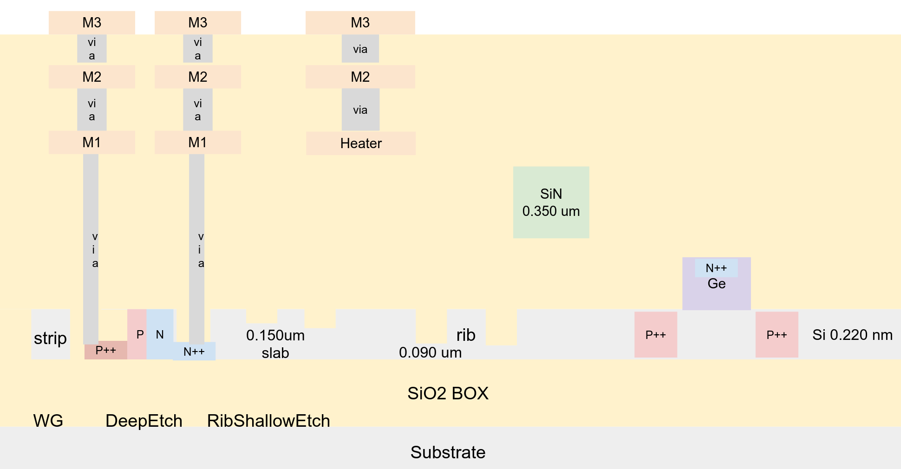
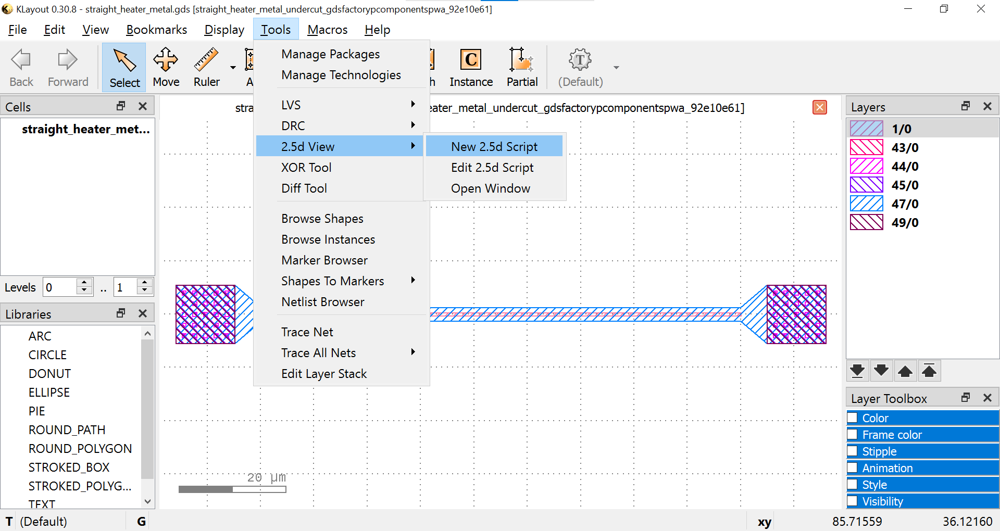
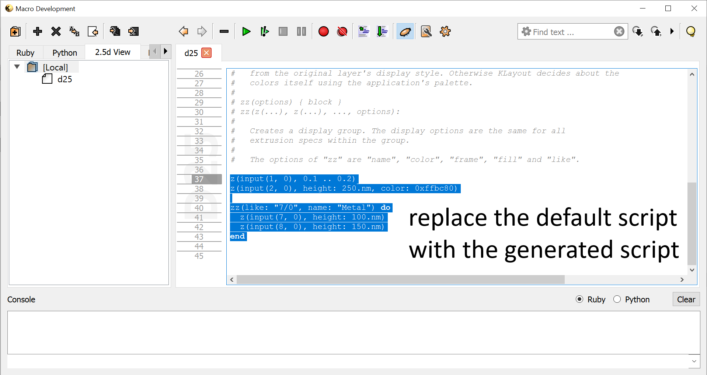
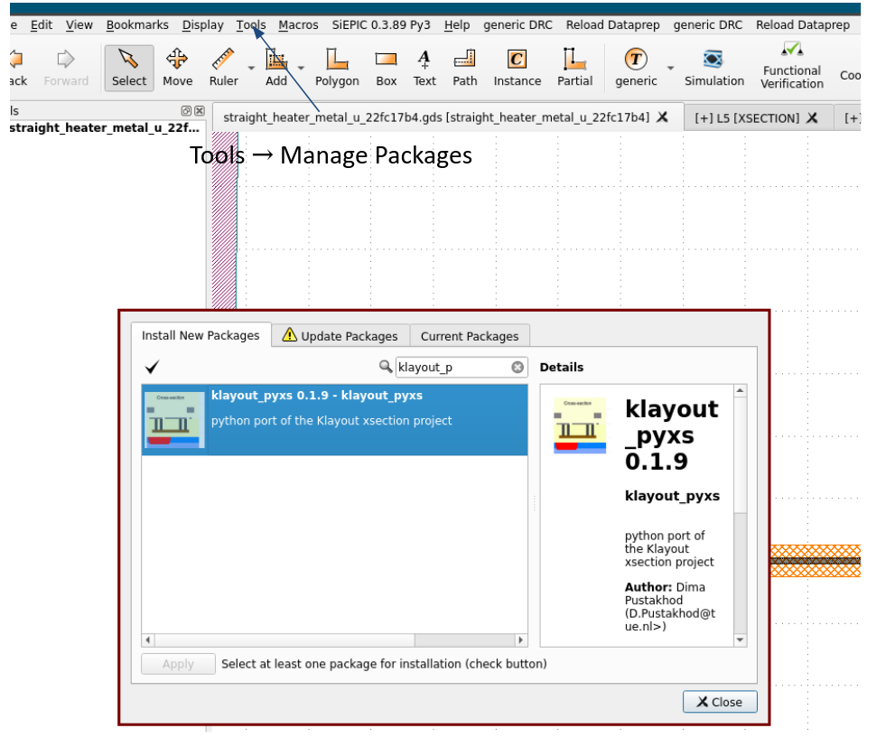
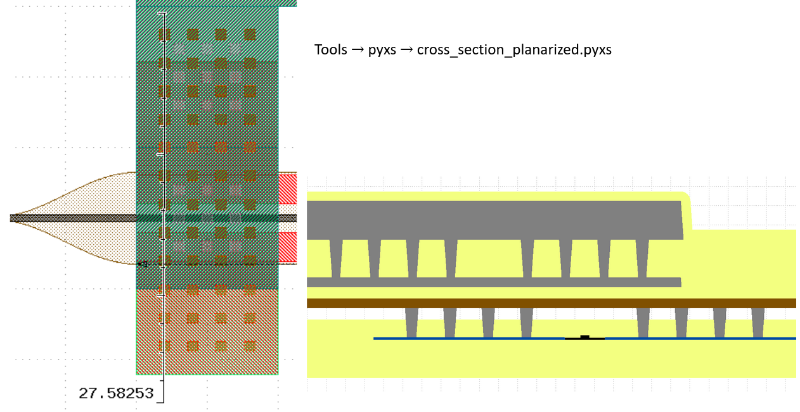

# Layers and layer stacks

GDSFactory includes a generic Process Design Kit PDK, which is a library of components associated to a generic foundry process `gdsfactory.gpdk`.
See components available in the [generic component library](https://gdsfactory.github.io/gdsfactory/components.html) that you can customize or adapt to create your own.

The generic process including layer numbers is based on the book "Silicon Photonics Design: From Devices to Systems Lukas Chrostowski, Michael Hochberg".
You can learn more about process design kits (PDKs) [in this tutorial](https://gdsfactory.github.io/gdsfactory/notebooks/08_pdk.html)

## LayerMap

A layer map maps layer names to an integer numbers pair (GDSlayer, GDSpurpose)

Each foundry uses different GDS layer numbers for different process steps.

| GDS (layer, purpose) | layer_name | Description                                                 |
| -------------------- | ---------- | ----------------------------------------------------------- |
| 1 , 0                | WG         | 220 nm Silicon core                                         |
| 2 , 0                | SLAB150    | 150nm Silicon slab (70nm shallow Etch for grating couplers) |
| 3 , 0                | SLAB90     | 90nm Silicon slab (for modulators)                          |
| 4, 0                 | DEEPTRENCH | Deep trench                                                 |
| 47, 0                | MH         | heater                                                      |
| 41, 0                | M1         | metal 1                                                     |
| 45, 0                | M2         | metal 2                                                     |
| 40, 0                | VIAC       | VIAC to contact Ge, NPP or PPP                              |
| 44, 0                | VIA1       | VIA1                                                        |
| 46, 0                | PADOPEN    | Bond pad opening                                            |
| 51, 0                | UNDERCUT   | Undercut                                                    |
| 66, 0                | TEXT       | Text markup                                                 |
| 64, 0                | FLOORPLAN  | Mask floorplan                                              |

```python
from IPython.display import Code

import gdsfactory as gf
from gdsfactory.config import PATH
from gdsfactory.gpdk import LAYER_STACK, get_generic_pdk
from gdsfactory.gpdk.get_klayout_pyxs import get_klayout_pyxs
from gdsfactory.technology import LayerLevel, LayerMap, LayerStack, LayerViews
from gdsfactory.typings import Layer

gf.gpdk.PDK.activate()

```

```python
class LAYER(LayerMap):
    """Generic layermap based on book.

    Lukas Chrostowski, Michael Hochberg, "Silicon Photonics Design",
    Cambridge University Press 2015, page 353
    You will need to create a new LayerMap with your specific foundry layers.
    """

    WAFER: Layer = (999, 0)

    WG: Layer = (1, 0)
    WGCLAD: Layer = (111, 0)
    SLAB150: Layer = (2, 0)
    SLAB90: Layer = (3, 0)
    DEEPTRENCH: Layer = (4, 0)
    GE: Layer = (5, 0)
    UNDERCUT: Layer = (6, 0)
    WGN: Layer = (34, 0)
    WGN_CLAD: Layer = (36, 0)

    N: Layer = (20, 0)
    NP: Layer = (22, 0)
    NPP: Layer = (24, 0)
    P: Layer = (21, 0)
    PP: Layer = (23, 0)
    PPP: Layer = (25, 0)
    GEN: Layer = (26, 0)
    GEP: Layer = (27, 0)

    HEATER: Layer = (47, 0)
    M1: Layer = (41, 0)
    M2: Layer = (45, 0)
    M3: Layer = (49, 0)
    VIAC: Layer = (40, 0)
    VIA1: Layer = (44, 0)
    VIA2: Layer = (43, 0)
    PADOPEN: Layer = (46, 0)

    DICING: Layer = (100, 0)
    NO_TILE_SI: Layer = (71, 0)
    PADDING: Layer = (67, 0)
    DEVREC: Layer = (68, 0)
    FLOORPLAN: Layer = (64, 0)
    TEXT: Layer = (66, 0)
    PORT: Layer = (1, 10)
    PORTE: Layer = (1, 11)
    PORTH: Layer = (70, 0)
    SHOW_PORTS: Layer = (1, 12)
    LABEL_SETTINGS: Layer = (202, 0)
    DRC_MARKER: Layer = (205, 0)
    LABEL_INSTANCE: Layer = (206, 0)

    SOURCE: Layer = (110, 0)
    MONITOR: Layer = (101, 0)


LAYER.WG
```

```python
layer_wg = (1, 0)
print(layer_wg)
```

### Extract layers

You can also extract layers using the `extract` function. This function returns a new flattened component that contains the extracted layers.
A flat component does not have references, and all the polygons are absorbed into the top cell.

```python
# A PDK is a collection of pre-defined components, layers, and design rules for a specific manufacturing process. 
# This code loads a generic, open-source PDK and sets it as the active one for the current gdsfactory session.
PDK = get_generic_pdk()

# This line retrieves the layer_views object from the PDK. 
# This object contains information on how each layer in the PDK should be displayed, including its color, transparency, and name.
LAYER_VIEWS = PDK.get_layer_views()

# This is a helper function that creates a gdsfactory component specifically designed to visualize the entire layer set.
# It draws a series of labeled, colored boxes, with each box representing a different layer from the PDK.
c = LAYER_VIEWS.preview_layerset()
c.plot()
```

```python
extract = c.extract(layers=((41, 0), (40, 0)))
extract.plot()
```

### Remove layers

You can remove layers using the `remove_layers()` function.

```python
# .extract(...): This is a method that acts like a filter.
# It goes through the component c and pulls out only the shapes that are on the layers specified in the layers argument.
# layers=((41, 0), (40, 0)): This tuple specifies which layers to keep. In this case, it will extract all geometry from layer (41, 0) and layer (40, 0).
# The result is a brand new component, assigned to the extract variable, that contains a copy of only the desired shapes.
removed = extract.remove_layers(layers=((40, 0),))
removed.plot()
```

### Remap layers

You can remap (change the polygons from one layer to another layer) using the `remap_layer`, which will return a new `Component`

```python
c = gf.components.rectangle(layer=(2, 0))
c.plot()
```

```python
c = c.copy() # This line creates a duplicate of the original component c. This is good practice to ensure that the original component remains unchanged.

# The remap_layers method goes through the component and reassigns layers based on the dictionary provided.
# The dictionary {(2, 0): (34, 0)} defines the mapping rule: "find all shapes on layer (2, 0) and move them to layer (34, 0)."
# remap_layers modifies the component in place and returns it, so remap is the same component as c.
remap = c.remap_layers({(2, 0): (34, 0)})
remap.plot()
```

## LayerViews

Klayout shows each GDS layer with a color, style and transparency.

You can define your layerViews in a klayout Layer Properties file `layers.lyp` or in `YAML` format.

We recommend using YAML and then generate the lyp in klayout, as YAML is easier to modify than XML.

```python
Code(filename=PATH.klayout_yaml)
```

Once you modify the `YAML` file you can easily write it to klayout layer properties `lyp` or the other way around.

```
YAML <---> LYP
```

The functions `LayerView.to_lyp(filepath)` and `LayerView.to_yaml(filepath)` allow you to convert from each other.

LYP is based on XML so it's much easier to make changes and maintain the equivalent YAML file.


### YAML -> LYP

You can easily convert from YAML into Klayout Layer Properties.

```python
# A KLayout Layer Properties (.lyp) file stores all the visual settings for your layers, such as color, fill pattern, name, and visibility.
# This line reads the settings from the .lyp file specified by PATH.klayout_lyp and loads them into a LayerViews object in memory.
LAYER_VIEWS = LayerViews(filepath=PATH.klayout_lyp)

# This line takes the LayerViews object, which now holds all the settings from the original file, 
# and writes them out to a new file named klayout_layers.lyp inside the extra directory.
LAYER_VIEWS.to_lyp("extra/klayout_layers.lyp")
```

### LYP -> YAML

Sometimes you start from an LYP XML file. We recommend converting to YAML and using the YAML as the layer views source of truth.

Layers in YAML are easier to read and modify than doing it in klayout XML format.

```python
LAYER_VIEWS = LayerViews(filepath=PATH.klayout_lyp)

# This line takes the LayerViews object and writes the settings to a new file named layers.yaml in YAML format.
# YAML is a text-based format that is easy for humans to read and edit, and it's also easily parsed by software.
LAYER_VIEWS.to_yaml("extra/layers.yaml")
```

### Preview layerset

You can preview all the layers defined in your `LayerViews`

```python
c = LAYER_VIEWS.preview_layerset()
c.plot()
```

By default the generic PDK has some layers that are not visible and therefore are not shown.

```python
c_wg_clad = c.extract(layers=[(1, 0)])
c_wg_clad.plot()
```

```python
# .layer_views: This is an attribute of the LAYER_VIEWS object that acts like a dictionary,
#  where the keys are the layer names (e.g., "WGCLAD", "SI") and the values are the display settings for each layer.
# ["WGCLAD"]: This is standard dictionary syntax to look up and return the settings associated with the key "WGCLAD".
LAYER_VIEWS.layer_views["WGCLAD"]
```

```python
# .visible: This is a boolean attribute of the layer view object that returns True if the layer is set to be visible in the KLayout viewer,
# and False if it is hidden.
LAYER_VIEWS.layer_views["WGCLAD"].visible
```

You can make it visible

```python
# LAYER_VIEWS.layer_views["WGCLAD"].visible = True
# This line accesses the display settings for the layer named "WGCLAD" and sets its visible property to True.
# This would make the layer visible in the KLayout viewer when these layer properties are loaded.
LAYER_VIEWS.layer_views["WGCLAD"].visible = True
```

```python
# LAYER_VIEWS.layer_views["WGCLAD"].visible
# In an interactive session, this line would retrieve and display the new visibility status, which would be True.
LAYER_VIEWS.layer_views["WGCLAD"].visible
```

```python
c_ge = c.extract(layers=[(5, 0)])
c_ge.plot()
```

## LayerStack

Each layer also includes the information of thickness and position of each layer after fabrication.

This LayerStack can be used for creating a 3D model with `Component.to_3d` or running simulations.

A GDS has different layers to describe the different fabrication process steps. And each grown layer needs thickness information and a z-position in the stack.



Let us define the layer stack for the generic layers in the generic_technology.

```python
import gdsfactory as gf

# This imports a predefined layer map named LAYER.
# This is a convenient object that contains ready-to-use definitions for common layers in a generic fabrication process,
# such as LAYER.WG for waveguides or LAYER.SLAB90 for slabs.
from gdsfactory.gpdk.layer_map import LAYER

# This imports the LogicalLayer class. This is a more structured way to define a layer,
#  allowing you to associate not just the GDSII layer and purpose numbers, but also other metadata like the material or the name of the layer.
from gdsfactory.technology import LogicalLayer

# This line sets up a convenient conversion factor. Since gdsfactory and most photonics tools work in micrometers (µm),
# this variable allows you to define thicknesses in nanometers (nm) and easily convert them to µm (1 nm = 0.001 µm).
nm = 1e-3

# This defines the total thickness of the main silicon waveguide layer as 220 nm (0.22 µm).
# This is a very common standard for Silicon-on-Insulator (SOI) wafers used in photonics.
# A deep etch is a microfabrication process characterized by its anisotropy, meaning it etches downwards much faster than sideways.
# A shallow etch is a microfabrication process that removes a thin, precisely controlled layer of material from the surface of a wafer,
# without cutting deep into it. It is the opposite of a deep etch.
thickness_wg = 220 * nm
thickness_slab_deep_etch = 90 * nm # thickness_slab_deep_etch = 90 * nm: Defines the slab thickness after a deep etch (a 90 nm slab remains).
thickness_slab_shallow_etch = 150 * nm # thickness_slab_shallow_etch = 150 * nm: Defines the slab thickness after a shallow etch (a 150 nm slab remains).

# This variable defines the sidewall angle of the waveguide in degrees.
# This parameter allows you to model the actual slope of the waveguide's sides. A value of 0 represents an ideal, perfectly vertical 90-degree etch.
sidewall_angle_wg = 0
layer_core = LogicalLayer(layer=LAYER.WG) #  Represents the main waveguide layer.
layer_shallow_etch = LogicalLayer(layer=LAYER.SHALLOW_ETCH) # Represents the areas to be shallowly etched.
layer_deep_etch = LogicalLayer(layer=LAYER.DEEP_ETCH) # Represents the areas to be deeply etched.


layers = {
    "core": LayerLevel(

        # This defines the final shape of the core.
        # It starts with the full waveguide shape (layer_core) and then "cuts away" the areas that are designated for deep etching and shallow etching.
        # The result is the geometry for the unetched, full-height part of the waveguide.
        layer=layer_core - layer_deep_etch - layer_shallow_etch,
        thickness=thickness_wg,
        zmin=0.0, # The vertical position where this layer starts
        material="si", # The material used is silicon
        mesh_order=2, # A priority setting used by simulation software when generating a mesh; higher numbers are processed first.
        sidewall_angle=sidewall_angle_wg,
        width_to_z=0.5, # For every 1 µm of height, the top surface is narrowed by 0.5 µm on each side. This creates a specific, sloped sidewall.
        derived_layer=layer_core,
    ),
    "shallow_etch": LayerLevel(
        layer=LogicalLayer(layer=LAYER.SHALLOW_ETCH),
        thickness=thickness_wg - thickness_slab_shallow_etch,
        zmin=0.0,
        material="si",
        mesh_order=1,
        derived_layer=LogicalLayer(layer=LAYER.SLAB150),
    ),
    "deep_etch": LayerLevel(
        layer=LogicalLayer(layer=LAYER.DEEP_ETCH),
        thickness=thickness_wg - thickness_slab_deep_etch,
        zmin=0.0,
        material="si",
        mesh_order=1,
        derived_layer=LogicalLayer(layer=LAYER.SLAB90),
    ),
    "slab150": LayerLevel(
        layer=LogicalLayer(layer=LAYER.SLAB150),
        thickness=150e-3,
        zmin=0,
        material="si",
        mesh_order=3,
    ),
    "slab90": LayerLevel(
        layer=LogicalLayer(layer=LAYER.SLAB90),
        thickness=thickness_slab_deep_etch,
        zmin=0.0,
        material="si",
        mesh_order=2,
    ),
}


layer_stack = LayerStack(layers=layers)

c = gf.c.grating_coupler_elliptical_trenches()
s = c.to_3d(layer_stack=layer_stack)
s.show()
```

```python
from gdsfactory.gpdk.layer_stack import get_layer_stack

layer_stack220 = get_layer_stack()

# Rib Waveguide: Unlike a strip waveguide, a rib waveguide has a central core on top of a thinner "slab" of the same material.
# This design offers a good balance between light confinement and lower propagation losses.
# On either side of the rib core, there are doped P and N regions. These act as a resistive heater.
# When a voltage is applied, current flows through these regions, generating heat to change the waveguide's refractive index.
# Length: The length=100 parameter sets the total length of the component to 100 µm.
c = gf.c.straight_heater_doped_rib(length=100)
c
```

```python
scene = c.to_3d(layer_stack=layer_stack220)
scene.show()
```

```python
c = gf.components.straight_heater_metal(length=90)
c.plot()
```

```python
scene = c.to_3d(layer_stack=layer_stack220)
scene.show()
```

```python
# The taper_strip_to_ridge_trenches() component acts as a taper for the waveguide core and adds trenches on either side that define the rib structure.
# The trenches are etched into the silicon, leaving behind the central rib and the surrounding slab.
c = gf.components.taper_strip_to_ridge_trenches()
c.plot()
```

```python
scene = c.to_3d(layer_stack=layer_stack220)
scene.show()
```

```python
# Let us assume we have 900nm silicon instead of 220nm, you will see a much thicker waveguide under the metal heater.
layer_stack900 = get_layer_stack(thickness_wg=900 * nm)
scene = c.to_3d(layer_stack=layer_stack900)
scene.show()
```

```python
import gdsfactory as gf

c = gf.components.grating_coupler_elliptical_trenches()
c.plot()
```

```python
scene = c.to_3d()
scene.show()
```

### 3D rendering

To render components in 3D you will need to define two things:

1. LayerStack: for each layer contains thickness of each material and z position
2. LayerViews: for each layer contains view (color, pattern, opacity). You can load it with `gf.technology.LayerView.load_lyp()`

```python
heater = gf.components.straight_heater_metal(length=90)
heater.plot()
```

```python
scene = heater.to_3d()
scene.show()
```

### Background materials

By default `to_3d` only extrudes the polygons that exist on each layer. Set `background=True` on a `LayerLevel` to extrude that material across the whole component **bounding box**, even where there are no polygons on its layer. This is handy for substrates, buried-oxide/cladding fill, or any bulk material that should surround the device.

Two things to keep in mind:

- Background levels are rendered in 3D even if their layer view is not visible (a substrate like `WAFER` is usually hidden in 2D). The material still takes its color from its layer view.
- Use `background_exclude_layers` to subtract other layers from the background volume (for example to carve etches out of a substrate). Only source (logical) layers can be excluded; derived/boolean layers are not supported.

```python
from gdsfactory.technology import LogicalLayer

c = gf.components.rectangle(size=(10, 5), layer=LAYER.WG)

layer_stack_background = LayerStack(
    layers={
        "substrate": LayerLevel(
            layer=LogicalLayer(layer=LAYER.WAFER),
            thickness=2,
            zmin=-2,
            material="si",
            background=True,  # fill the whole component bounding box
        ),
        "core": LayerLevel(
            layer=LogicalLayer(layer=LAYER.WG),
            thickness=0.22,
            zmin=0,
            material="si",
        ),
    }
)

c.plot()
```

```python
scene = c.to_3d(layer_stack=layer_stack_background)
scene.show()
```

You can subtract layers from a background material with `background_exclude_layers`. Here a `DEEP_ETCH` shape carves a full-depth etch out of the bulk silicon.

```python
c = gf.Component()
c.add_polygon([(0, 0), (10, 0), (10, 10), (0, 10)], layer=LAYER.WG)
c.add_polygon([(4, 0), (6, 0), (6, 10), (4, 10)], layer=LAYER.DEEP_ETCH)

layer_stack_exclude = LayerStack(
    layers={
        "bulk": LayerLevel(
            layer=LogicalLayer(layer=LAYER.WG),
            thickness=1,
            zmin=0,
            material="si",
            background=True,
            background_exclude_layers=(LAYER.DEEP_ETCH,),  # subtract this etch layer
        ),
    }
)

c.plot()
```

```python
scene = c.to_3d(layer_stack=layer_stack_exclude)
scene.show()
```

### Klayout 2.5D view

From the `LayerStack` you can generate the KLayout 2.5D view script.

```python
print(LAYER_STACK.get_klayout_3d_script())
```

<!-- #region -->
Then you go to Tools → 2.5d View -> New 2.5d Script




and paste the 2.5D view script


<!-- #endregion -->

### Klayout cross-section

You can also install the [KLayout cross-section plugin](https://gdsfactory.github.io/klayout_pyxs/README.html)



This is not integrated with the LayerStack but you can customize the script in `gdsfactory.gpdk.get_klayout_pyxs` for your technology.

```python
nm = 1e-3
if __name__ == "__main__":

    # t_...: Defines the thickness of different material layers (e.g., t_si=220*nm for the silicon device layer, t_m1=0.5 for the first metal layer).
    # h_etch...: Defines the height or depth of different etching steps.
    # gap_...: Defines the vertical gap or spacing between layers (e.g., gap_m1_m2=0.6 for the space between metal 1 and metal 2).
    # The layer_ function help with layer assignments:
    # These parameters map the different logical parts of the design to specific GDSII layer numbers (e.g., LAYER.WG, LAYER.M1).
    # Waveguide Layers: layer_wg, layer_rib, layer_nitride.
    # Doping Layers: layer_n, layer_p, layer_npp, etc., for creating electronic junctions.
    # Germanium Layers: layer_Ge, layer_GePPp for photodetectors.
    # Metal and Via Layers: layer_m1, layer_via1, layer_m2, etc., for electrical routing.
    
    script = get_klayout_pyxs(
        t_box=2.0,
        t_slab=110 * nm,
        t_si=220 * nm,
        t_ge=400 * nm,
        t_nitride=400 * nm,
        h_etch1=0.07,
        h_etch2=0.06,
        h_etch3=0.09,
        t_clad=0.6,
        t_m1=0.5,
        t_m2=0.5,
        t_m3=2.0,
        gap_m1_m2=0.6,
        gap_m2_m3=0.3,
        t_heater=0.1,
        gap_oxide_nitride=0.82,
        t_m1_oxide=0.6,
        t_m2_oxide=2.0,
        t_m3_oxide=0.5,
        layer_wg=(1, 0),
        layer_fc=(2, 0),
        layer_rib=LAYER.SLAB90,
        layer_n=LAYER.N,
        layer_np=LAYER.NP,
        layer_npp=LAYER.NPP,
        layer_p=LAYER.P,
        layer_pp=LAYER.PP,
        layer_ppp=LAYER.PPP,
        layer_PDPP=LAYER.GEP,
        layer_nitride=LAYER.WGN,
        layer_Ge=LAYER.GE,
        layer_GePPp=LAYER.GEP,
        layer_GeNPP=LAYER.GEN,
        layer_viac=LAYER.VIAC,
        layer_viac_slot=LAYER.VIAC,
        layer_m1=LAYER.M1,
        layer_mh=LAYER.HEATER,
        layer_via1=LAYER.VIA1,
        layer_m2=LAYER.M2,
        layer_via2=LAYER.VIA2,
        layer_m3=LAYER.M3,
        layer_open=LAYER.PADOPEN,
    )

    # script_path = pathlib.Path(__file__).parent.absolute() / "xsection_planarized.pyxs".
    # script_path.write_text(script).
    print(script)
```





## Process

The LayerStack uses the GDS layers to generate a representation of the chip after fabrication.

The KLayout cross-section module uses the GDS layers to return a geometric approximation of the processed wafer.

Sometimes, however, physical process modeling is desired.

For these purposes, processes acting on an initial substrate "wafer stack" can be defined. The waferstack is a LayerStack representing the initial state of the wafer. The processes take in some combination of GDS layers (which may differ from their use in the resulting LayerStack), some processing parameters, and are then run in sequence.

For instance, the early step of the front-end-of-line of the generic process could be approximated as done in `gdsfactory.technology.layer_stack` (the process classes are described in `gdsfactory.technology.processes`):


```python
import gdsfactory.technology.processes as gp


def get_process():
    """Returns generic process to generate LayerStack.

    Represents processing steps that will result in the GenericLayerStack, starting from the waferstack LayerStack.

    based on paper https://www.degruyter.com/document/doi/10.1515/nanoph-2013-0034/html
    """
    return (
        
        # The first, deeper etch:
        gp.Etch(
            name="strip_etch",
            layer=(1, 0),
            positive_tone=False, # Specifies a negative tone process, the areas covered by the mask are protected, and the surrounding material is etched away.
            
            # +0.01 signals a slight over-etch.
            # A slight overetch is the intentional removal of a small, extra amount of material during the chip fabrication process.
            # It is a planned "safety margin" to ensure that the etch is complete and uniform across the entire wafer.
            depth=0.22 + 0.01, 
            material="core",

            # The resist thickness must be precisely controlled for two main reasons:
            # Resolution: If the resist is too thick, it can be difficult to create fine, high-resolution features.
            # Durability: The resist must be thick enough to withstand the etching process without being completely eroded
            # before the underlying material has been fully etched.
            resist_thickness=1.0,
        ),
        
        # The second, shallower etch:
        gp.Etch(
            name="slab_etch",
            layer=LAYER.SLAB90,
            layers_diff=[(1, 0)],
            depth=0.22 - 0.09, # The etch depth is 0.13 µm. This is a partial etch, leaving a 90 nm slab of silicon (0.22 - 0.13 = 0.09).
            material="core",
            resist_thickness=1.0,
        ),
        # See gplugins.process.implant tables for ballpark numbers
        # Adjust to your process

        # This ImplantPhysical object models the process of implanting ions into a wafer to change its electrical properties (a process called doping).
        gp.ImplantPhysical(
            name="deep_n_implant",
            layer=LAYER.N, # The GDSII layer that acts as the mask. The implant will only occur in the areas defined by the shapes on this layer.
            energy=100, # The implantation energy in keV. Higher energy results in the ions being implanted deeper into the material.
            
            # The type of ion being implanted, in this case, Phosphorus (P).
            # Phosphorus has one more valence electron than silicon, so implanting it creates N-type doped silicon.
            ion="P", 
            dose=1e12, # The ion dose, in atoms per cm². This determines the concentration of dopant atoms that are implanted.
            resist_thickness=1.0,
        ),
        gp.ImplantPhysical(
            name="shallow_n_implant",
            layer=LAYER.N,
            energy=50,
            ion="P",
            dose=1e12,
            resist_thickness=1.0,
        ),
        gp.ImplantPhysical(
            name="deep_p_implant",
            layer=LAYER.P,
            energy=50,
            ion="B", # The type of ion being implanted is Boron (B), it has one less valence electron than silicon, this makes it a P-type dopant.
            dose=1e12,
            resist_thickness=1.0,
        ),
        gp.ImplantPhysical(
            name="shallow_p_implant",
            layer=LAYER.P,
            energy=15,
            ion="B",
            dose=1e12,
            resist_thickness=1.0,
        ),
        # "Temperatures of ~1000C for not more than a few seconds"
        # Adjust to your process
        # https://en.wikipedia.org/wiki/Rapid_thermal_processing
        gp.Anneal(
            name="dopant_activation",
            time=1,
            temperature=1000,
        ),
    )

# This code calls a function named get_process() to load a predefined semiconductor fabrication process.
process = get_process()
```


These process dataclasses can then be used in physical simulator plugins.
