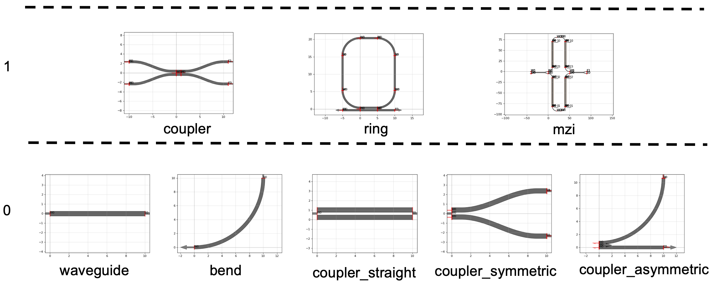

# Components with hierarchy



You can define component parametric cells (waveguides, bends, couplers) as functions with basic input parameters (width, length, radius ...) and use them as arguments for composing more complex functions.

```python
from functools import partial

import toolz

import gdsfactory as gf
from gdsfactory.typings import ComponentSpec
from gdsfactory.cross_section import CrossSectionSpec

gf.gpdk.PDK.activate()

```


**Problem**

When using hierarchical cells where you pass `N` subcells with `M` parameters you can end up with `N*M` parameters. This will make it hard to read the code.


```python
@gf.cell
def bend_with_straight_with_too_many_input_parameters(
    bend=gf.components.bend_euler,
    straight=gf.components.straight,
    length: float = 3,
    angle: float = 90.0,
    p: float = 0.5,
    with_arc_floorplan: bool = True,
    npoints: int | None = None,
    cross_section: CrossSectionSpec = "strip",
) -> gf.Component:
    """As hierarchical cells become more complex, the number of input parameters can increase significantly."""
    c = gf.Component()
    b = bend(
        angle=angle,
        p=p,
        with_arc_floorplan=with_arc_floorplan,
        npoints=npoints,
        cross_section=cross_section,
    )
    s = straight(length=length, cross_section=cross_section)

    bref = c << b
    sref = c << s

    sref.connect("o2", bref.ports["o2"])
    c.info["length"] = b.info["length"] + s.info["length"]
    return c


c = bend_with_straight_with_too_many_input_parameters()
c.plot()
```


**Solution**

You can use a ComponentSpec parameter for every subcell. The ComponentSpec can be a dictionary with arbitrary number of settings, a string, or a function.

## ComponentSpec

When defining a `Parametric cell` you can use other `ComponentSpec` as an argument. It can be a:

1. string: function name of a cell registered on the active PDK. `"bend_circular"`.
2. dict: `dict(component='bend_circular', settings=dict(radius=20))`.
3. function: Using `functools.partial` you can customize the default parameters of a function.


```python
@gf.cell
def bend_with_straight(
    bend: ComponentSpec = gf.components.bend_euler,
    straight: ComponentSpec = gf.components.straight,
) -> gf.Component:
    """Much simpler version.

    Args:
        bend: input bend.
        straight: output straight.
    """
    c = gf.Component()
    b = gf.get_component(bend)
    s = gf.get_component(straight)

    bref = c << b
    sref = c << s

    sref.connect("o2", bref.ports["o2"])
    c.info["length"] = b.info["length"] + s.info["length"]
    return c


c = bend_with_straight()
c.plot()
```

### 1. String

You can use any string registered in the `PDK`. Go to the PDK tutorial to learn how to register cells in a PDK.

```python
c = bend_with_straight(bend="bend_circular")
c.plot()
```

### 2. Dictionary

You can pass a `dict` of settings.

```python
bend = gf.get_component("bend_circular", radius=20)

c = bend_with_straight(bend=bend)
c.plot()
```

### 3. Function

You can pass a function of a function with customized default input parameters `from functools import partial`.

Partial lets you define different default parameters for a function, so you can modify the default settings for each child cell.

```python
c = bend_with_straight(bend=partial(gf.components.bend_circular, radius=30))
c.plot()
```

```python
bend20 = partial(gf.components.bend_circular, radius=20)
b = bend20()
b.plot()
```

```python
type(bend20)
```

```python
bend20.func.__name__
```

```python
bend20.keywords
```

```python
b = bend_with_straight(bend=bend20)
print(b.info.length)
b.plot()
```

```python
# You can still modify the bend to have any bend radius.
b3 = bend20(radius=10)
b3.plot()
```

## Composing functions

You can combine more complex functions out of smaller functions.

Let us say that we want to add tapers and grating couplers to a wide waveguide:

```python
c1 = gf.components.straight()
c1.plot()
```

```python
straight_wide = partial(gf.components.straight, width=3)
c3 = straight_wide()
c3.plot()
```

```python
c1 = gf.components.straight()
c1.plot()
```

```python
c2 = gf.c.extend_ports(c1, length=5)
c2
```

```python
c3 = gf.routing.add_fiber_array(c2, with_loopback=False)
c3.plot()
```

Now we do it with a **single** step thanks to `toolz.pipe`.

```python

# The partial function is used to create simplified, pre-configured versions of other functions.
# add_fiber_array: A new version of the function that adds grating couplers, but with the with_loopback option always set to False.
# add_tapers: A new function that extends ports, but is pre-configured to always use the defined taper component as the extension.
add_fiber_array = partial(gf.routing.add_fiber_array, with_loopback=False)

c1 = gf.c.straight(width=5)
taper = gf.components.taper(length=10, width1=5, width2=0.5)
add_tapers = partial(gf.c.extend_ports, extension=taper)

# Pipe is more readable than the equivalent add_fiber_array(add_tapers(c1)).
# The toolz.pipe function takes an initial object (c1) and "pipes" it through a series of functions. The output of one function becomes the input for the next.
c3 = toolz.pipe(c1, add_tapers, add_fiber_array)
c3.plot()
```

we can even combine `add_tapers` and `add_fiber_array` thanks to `toolz.compose` or `toolz.compose`

For example:

```python
add_tapers_fiber_array = toolz.compose_left(add_tapers, add_fiber_array)
c4 = add_tapers_fiber_array(c1)
c4.plot()
```

is equivalent to:

```python
c5 = add_fiber_array(add_tapers(c1))
c5.plot()
```

which is the same as:

```python
add_tapers_fiber_array = toolz.compose(add_fiber_array, add_tapers)
c6 = add_tapers_fiber_array(c1)
c6.plot()
```

or:

```python
c7 = toolz.pipe(c1, add_tapers, add_fiber_array)
c7.plot()
```
