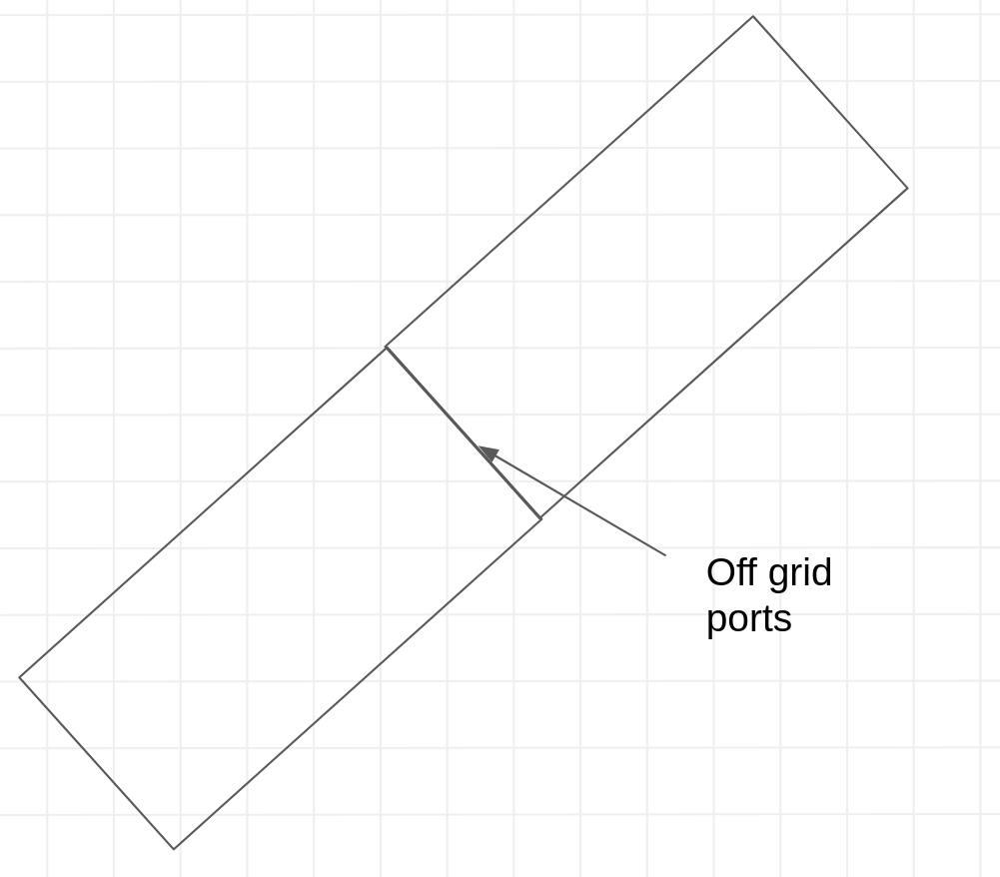
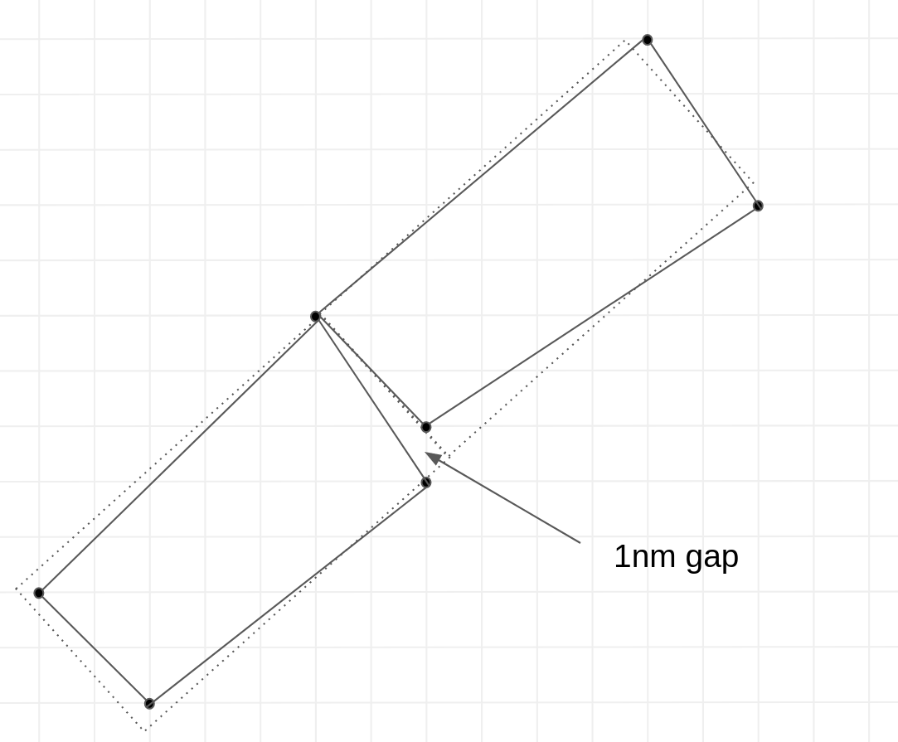
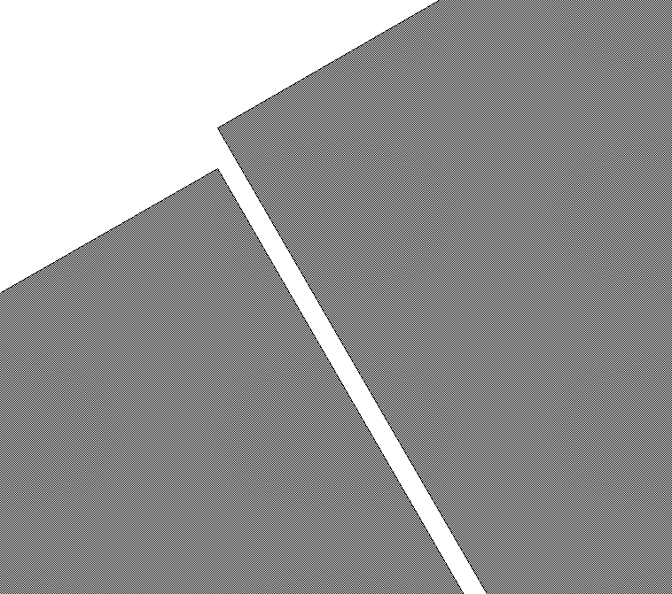
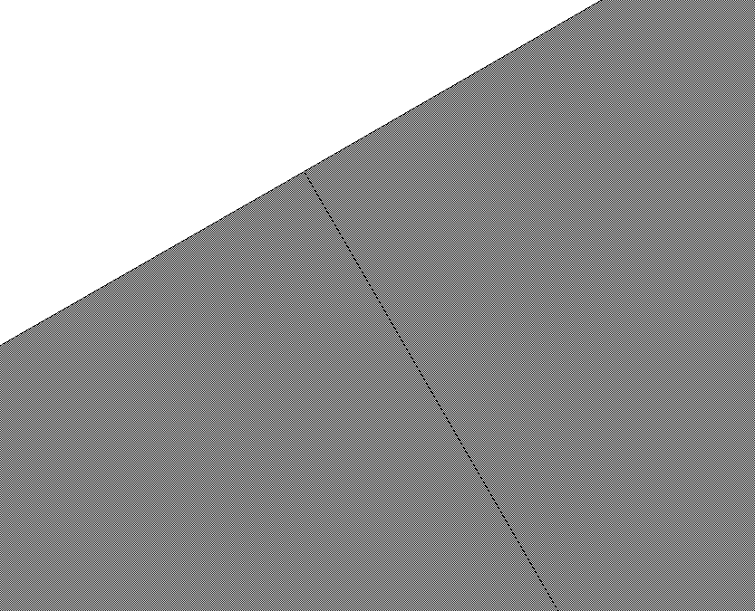

<!-- #region -->
# Grid snapping

GDS represents points as integers where each point corresponds to a database unit (DBU). Typically, in most foundries, the default DBU is set to 1 nanometer (1nm).

GDSFactory snaps ports to the grid by default to avoid grid snapping errors which are common in layout designs. 

If you want to connect components off-grid you need to create a virtual cell, which operates in floats instead of DBUs.




Example of grid snapping errors.


<!-- #endregion -->

```python
import gdsfactory as gf

gf.gpdk.PDK.activate()

```

```python
nm = 1e-3
wg1 = gf.Component()
wg1.add_polygon(
    [(0, 0), (1.4 * nm, 0), (1.4 * nm, 1 * nm), (0, 1 * nm)], layer=(1, 0)
)  # rounds to 1 nm

wg1.add_polygon(
    [(0, 3 * nm), (1.6 * nm, 3 * nm), (1.6 * nm, 4 * nm), (0, 4 * nm)], layer=(1, 0)
)  # rounds to 2 nm

wg1.plot()
```

## Changing DBU

The default DBU (database unit) is set to 1 nm, but you can customize it to other values, such as 5 nm, depending on your design requirements.

```python
gf.kcl.dbu = 5e-3 # set 1 DataBase Unit to 5 nm
```

This script highlights the effect of rounding when the dbu is set to 5 nm. The discrepancies occur because the coordinate values are snapped to the nearest grid point, which is a multiple of 5 nm in this case.

This can lead to visual or functional differences when designing components with precise tolerances.

```python
wg1 = gf.Component()
DBU = 5e-3
LAYER = (1, 0)

# Add polygons with intentional coordinates to show rounding errors.
# Coordinate values that do not align perfectly with 5 nm dbu.
polygon1_coords = [
    (0, 0),
    (1.7 * DBU, 0),  # 1.7 * 5 nm = 8.5 nm, which will round to 10 nm.
    (1.7 * DBU, 1.3 * DBU),  # 1.3 * 5 nm = 6.5 nm, which will round to 5 nm.
    (0, 1.3 * DBU)
]
wg1.add_polygon(polygon1_coords, layer=LAYER)

polygon2_coords = [
    (0, 2.1 * DBU),  # 2.1 * 5 nm = 10.5 nm, which will round to 10 nm.
    (2.4 * DBU, 2.1 * DBU),  # 2.4 * 5 nm = 12 nm (aligned, no rounding).
    (2.4 * DBU, 3.9 * DBU),  # 3.9 * 5 nm = 19.5 nm, which will round to 20 nm.
    (0, 3.9 * DBU)
]
wg1.add_polygon(polygon2_coords, layer=LAYER)
wg1
```

```python
gf.kcl.dbu = 1e-3 # Change back 1 DataBase Unit to 1 nm.
```

## ⚠️ Warning: Manhattan Orientations

It's crucial to always maintain ports with Manhattan orientations (0, 90, 180, 270 degrees). Non-Manhattan ports can lead to ports snapping off the grid, resulting in 1nm gaps in your layouts, which can be detrimental to the design's integrity.

Although **gdsfactory** provides functions to connect and route component ports that are off-grid or have non-Manhattan orientations.

> **Note:** If you intend to create off-grid ports and non-Manhattan connections, you must enable this feature manually. This should be done with caution and a thorough understanding of the potential implications on your design.

```python
c = gf.Component()
w1 = c << gf.c.straight(length=4 * nm, width=4 * nm)
w1.rotate(45)

w2 = c << gf.c.straight(length=4 * nm, width=4 * nm)
w2.connect("o1", w1["o2"])
c  # In this case ports overlap by an extra nm because of the rotation, instead of connecting them with no overlap.
```

```python
c = gf.Component()
w1 = c << gf.components.straight(length=4 * nm, width=4 * nm)
w1.rotate(30)

w2 = c << gf.components.straight(length=4 * nm, width=4 * nm)
w2.connect("o1", w1["o2"])
c  # In this case ports have a 1nm gap error because of the rotation.
```


## Fix Non manhattan connections

The GDS format often has issues with non-manhattan shapes, due to the rounding of vertices to a unit grid and to downstream tools (i.e. DRC) which often tend to assume cell references only have rotations at 90 degree intervals.

To fix it, you can insert them as virtual instances.

For example:

```python
import gdsfactory as gf

nm = 1e-3
c = gf.Component()
w = gf.components.straight(length=4 * nm, width=4 * nm)

# An instance of component w1 is added to the main component c and then rotated by 30 degrees.
w1 = c.add_ref_off_grid(w)
w1.rotate(30)

# A second instance of w is added.
# The connect function then automatically moves and rotates this second instance (w2),
# so that its input port (o1) is perfectly aligned with the output port (o2) of the first, rotated instance (w1).
w2 = c.add_ref_off_grid(w)
w2.connect("o1", w1["o2"])
c
```

```python
import gdsfactory as gf


def demo_non_manhattan():
    c = gf.Component()
    b = c << gf.components.bend_circular(angle=30)
    s = c << gf.components.straight(length=5)
    s.connect("o1", b.ports["o2"])
    return c


c1 = demo_non_manhattan()
c1
```

<!-- #region -->
if you zoom in between the bends you will see a notch between waveguides due to non-manhattan connection between the bends.




## Solution
<!-- #endregion -->

```python
import gdsfactory as gf


@gf.vcell
def snap_bends() -> gf.ComponentAllAngle:

    # Instead of a standard gf.Component, a ComponentAllAngle is created.
    # This special container is necessary for managing shapes that are not restricted to 90-degree angles.
    c = gf.ComponentAllAngle()

    # A 37-degree Euler bend, designed for low-loss arbitrary angle turns, is created.
    # Two instances are placed in the component, and the second (b2) is connected to the end of the first (b1) to create a continuous, smooth curve.
    b = gf.c.bend_euler_all_angle(angle=37)
    b1 = c << b
    b2 = c << b
    b2.connect("o1", b1.ports["o2"])
    c.add_port("o1", port=b1.ports["o1"])
    c.add_port("o2", port=b2.ports["o2"])
    return c

# The final component c consists of the two 37-degree bends connected end-to-end, forming a single waveguide path that turns by a total of 74 degrees.
c = snap_bends()
c.show()
c
```

If you zoom into the connection you will now see a perfect connection:


