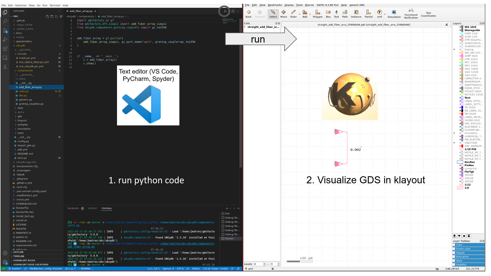
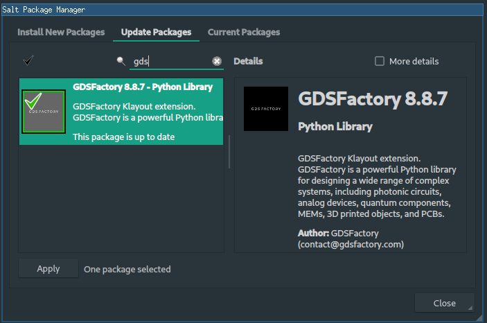

# KLayout integration

[KLayout](https://www.klayout.de/build.html) is a powerful open-source layout viewer and editor widely used in the semiconductor industry.

In the GDSFactory code-driven workflow, you define components, circuits, and reticles using Python or YAML. To enable rapid design iteration, GDSFactory includes a KLayout macro extension, which runs directly inside KLayout. This allows you to visualize your layouts instantly: when you call `component.show()` in Python, your GDS layout is automatically displayed in KLayout.

You can install the GDSFactory KLayout plugin to enable live GDS updates using `component.show()`, so you do not need to manually go through **File → Open → Select GDS** every time.

Installing the plugin adds the following features:

- Live display of GDS layouts with `component.show()`.
- Port visualization.
- PCell metadata inspection.
- Built-in `generic_pdk` layer map support.

