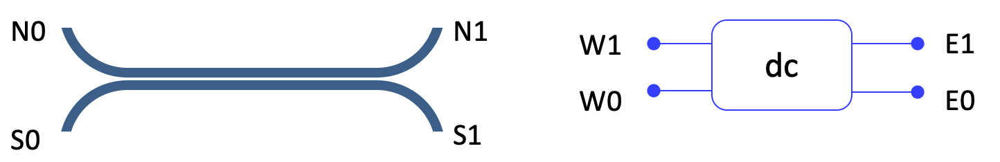

Ports
=============================

.. automodule:: pp.port

.. plot::
   :include-source:

   import pp

   y = 0.5
   x = 2
   c = pp.Component()
   c.add_polygon([(0, 0), (x, 0), (x, y), (0, y)], layer=1)
   c.add_port(name='W0', midpoint=(0, y/2), width=y, orientation=180, layer=1)
   pp.plotgds(c)

Ports are mostly used to:

 - facilitate positioning of components with respect to one another
 - connect components between each other using routing sub-routines

A component with a port can easily be referenced by the port.

.. plot::
   :include-source:

   import pp

   coupler = pp.c.coupler()
   c = pp.Component()

   # Instantiate a reference to `_cpl`, positioning 'W0' port at coords (0, 0)
   coupler1 = coupler.ref(port_id='W0', position=(0, 0))

   # Instantiate another reference to `_cpl`, positioning 'W0' port at
   # the position of the 'E0' port from cpl1
   coupler2 = coupler.ref(port_id='W0', position=coupler1.ports['E0'].position)

   c.add(coupler1)
   c.add(coupler2)
   pp.plotgds(c)

You will also need to add the ports of the child cells into the parent cell ::

   c.add_port(port=coupler1.ports['W0'])
   c.add_port(port=coupler1.ports['W1'])
   c.add_port(port=coupler2.ports['E0'])
   c.add_port(port=coupler2.ports['E1'])

`pp.Component.ref` also accepts arguments such as:

 - `h_mirror` (True / False),
 - `v_mirror` (True / False)
 - `rotation` (0 / 90 / 180 / 270)

 They implement the transformation w.r.t the port position given by port_id If no port_id is given, transformation is done w.r.t (0,0)

Ports can have flexible labelling and by default, the user chooses how to label the ports
in the component with the constraint of giving name unique names within this component.

A function `auto_rename_ports` is provided to automatically label ports according to the following convention:

 - photonics ports are labelled with strings that refer to the orientation
 - other ports are labelled from a prefix and numbered counter-clockwise starting from the east port

.. automodule:: pp
   :members: Port

.. autoclass:: phidl.device_layout.Port
   :members:
